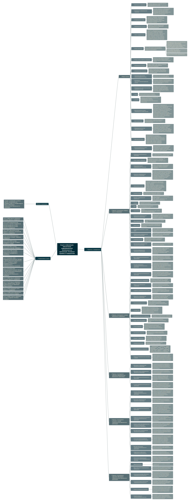

# Изучение ГОСТа и построение его Mind map

## Цель работы

Изучить ГОСТ из области защите информации и познакомиться с построением mindmap в программе
[Freeplane](https://docs.freeplane.org/)

## Ход работы

### Шаг 1. Выбор ГОСТа

Для построения mind map был взят [ГОСТ Р 53114-2008](https://docs.cntd.ru/document/1200075565)
"Защита информации. Обеспечение информационной безопасности в организации. Основные термины и определения"

### Шаг 2. Результат построения интеллект-карты

## Оценка результата

В результате выполнения работы был изучен ГОСТ Р 53114-2008 и была построена mind map в программе Freeplane

## Вывод

Таким образам был изучен ГОСТ была построена его mind map
